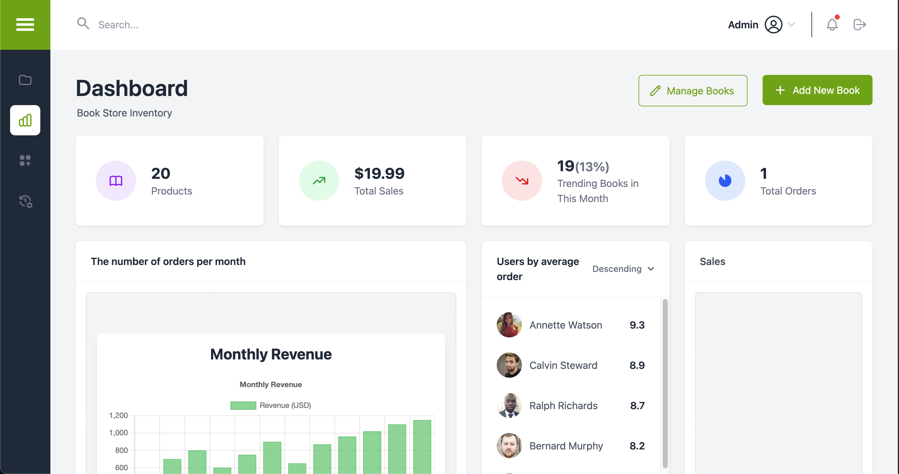

# BookNest 📚

A modern full-stack web application for book lovers to discover, track, and share their reading journey.

## 🖼️ Screenshots




## 🌐 Deployment

The latest deployed version is available here:
[Live Demo](https://booknest-app.vercel.app/)

## 🚀 Tech Stack

### Backend

-   Node.js with Express.js
-   MongoDB with Mongoose
-   JWT Authentication
-   BCrypt for password hashing
-   CORS enabled
-   Environment variables with dotenv

### Frontend

-   React.js (v19)
-   Vite.js for build tooling
-   Redux Toolkit for state management
-   React Router for navigation
-   TailwindCSS for styling
-   React Hook Form for form handling
-   Firebase integration
-   Chart.js with React-Chartjs-2
-   React Icons
-   React Toastify for notifications
-   Swiper for carousels

## 🛠️ Setup & Installation

### Prerequisites

-   Node.js (Latest LTS version)
-   MongoDB installed and running
-   Git

### Backend Setup

1. Navigate to the backend directory:
    ```bash
    cd backend
    ```
2. Install dependencies:
    ```bash
    npm install
    ```
3. Create a `.env` file with required environment variables
4. Start the development server:
    ```bash
    npm run start:dev
    ```

### Frontend Setup

1. Navigate to the frontend directory:
    ```bash
    cd frontend
    ```
2. Install dependencies:
    ```bash
    npm install
    ```
3. Start the development server:
    ```bash
    npm run dev
    ```

## 🌟 Features

-   User authentication and authorization
-   Book discovery and search
-   Personal reading lists and tracking
-   Responsive design
-   Interactive UI components
-   Real-time notifications

## 📝 API Documentation

The backend provides RESTful APIs for:

-   User management
-   Book operations
-   Reading lists
-   Progress tracking
-   Social features

## 🔒 Environment Variables

### Backend (.env)

Required environment variables:

-   `PORT`: Server port number
-   `MONGODB_URI`: MongoDB connection string
-   `JWT_SECRET`: Secret key for JWT
-   `NODE_ENV`: Development/production environment

### Frontend (.env)

Required environment variables:

-   `VITE_API_URL`: Backend API URL
-   Firebase configuration (if using Firebase features)

## 🧪 Testing

The project includes comprehensive testing:

-   Frontend: Unit tests with React Testing Library
-   Backend: API tests with Jest
-   E2E tests with Cypress

Run tests:

```bash
# Frontend tests
cd frontend
npm run test

# Backend tests
cd backend
npm run test
```

## 📦 Project Structure

```
booknest/
├── frontend/           # React frontend application
│   ├── src/
│   │   ├── components/  # Reusable UI components
│   │   ├── pages/       # Page components
│   │   ├── store/       # Redux store setup
│   │   ├── hooks/       # Custom React hooks
│   │   ├── utils/       # Utility functions
│   │   └── api/         # API integration
│   └── public/          # Static assets
│
├── backend/            # Express.js backend
│   ├── controllers/    # Request handlers
│   ├── models/        # Mongoose models
│   ├── routes/        # API routes
│   ├── middleware/    # Custom middleware
│   └── utils/         # Helper functions
│
└── assets/            # Shared assets
```

## 🚀 Deployment

### Frontend Deployment

-   Build the production bundle:
    ```bash
    cd frontend
    npm run build
    ```
-   Deploy the `dist` folder to your hosting service (e.g., Netlify, Vercel)

### Backend Deployment

-   Set up production environment variables
-   Deploy to your preferred hosting (e.g., Heroku, DigitalOcean)
-   Ensure MongoDB connection is configured correctly

## 🔄 CI/CD

The project uses GitHub Actions for:

-   Automated testing
-   Linting
-   Build verification
-   Automated deployment

## 🤝 Contributing

1. Fork the repository
2. Create your feature branch (`git checkout -b feature/AmazingFeature`)
3. Commit your changes (`git commit -m 'Add some AmazingFeature'`)
4. Push to the branch (`git push origin feature/AmazingFeature`)
5. Open a Pull Request

## 🐛 Known Issues

Please check the [Issues](https://github.com/yourusername/booknest/issues) page for current issues and feature requests.

## 📈 Future Roadmap

-   [ ] Mobile app development
-   [ ] Book recommendations using AI
-   [ ] Social networking features
-   [ ] Reading challenges and achievements
-   [ ] Integration with external book APIs

## 💫 Acknowledgments

-   [Create Vite](https://vitejs.dev/) for the frontend tooling
-   [Express.js](https://expressjs.com/) for the backend framework
-   [MongoDB](https://www.mongodb.com/) for the database
-   All open-source packages used in this project

## 👥 Author

Erik Nguyen

## 📄 License

ISC License
